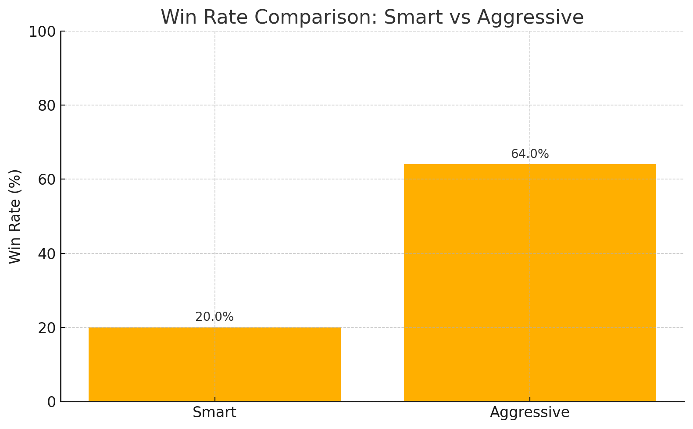
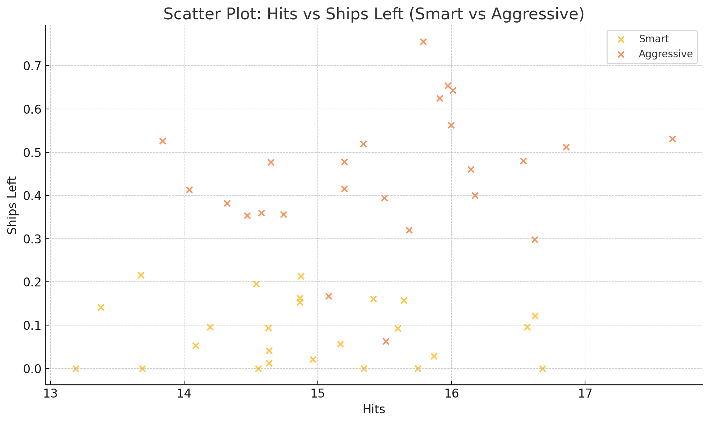
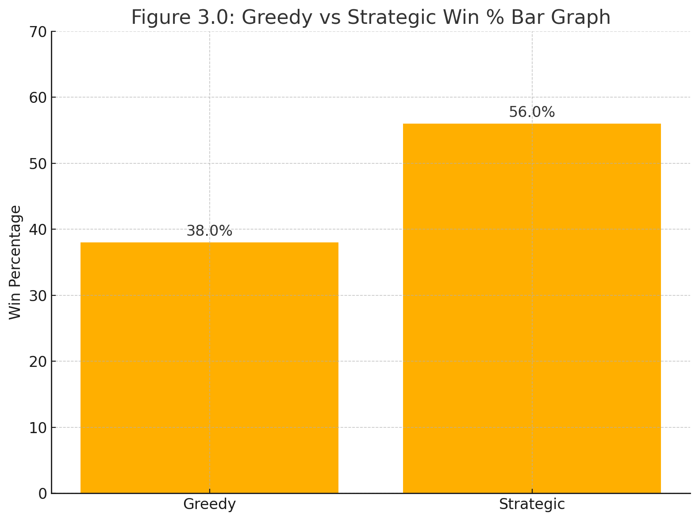
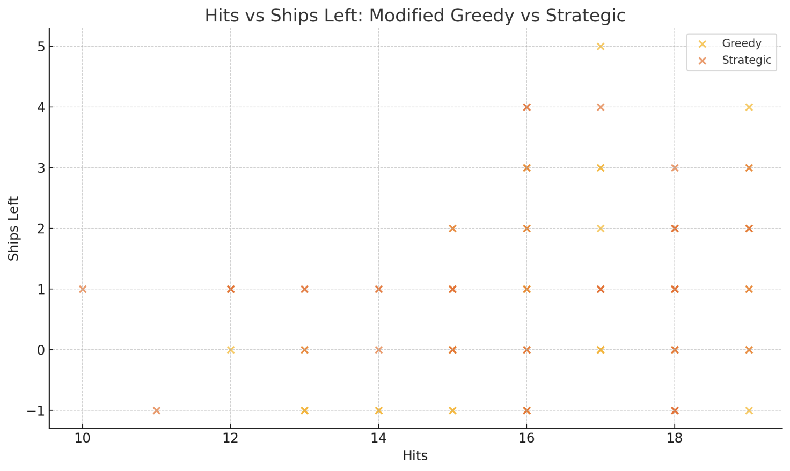
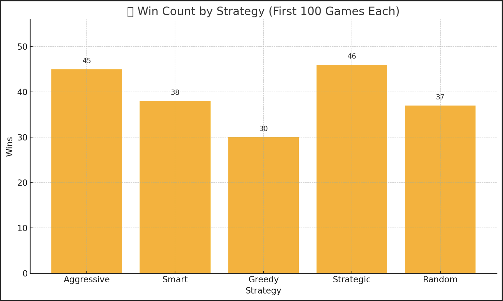
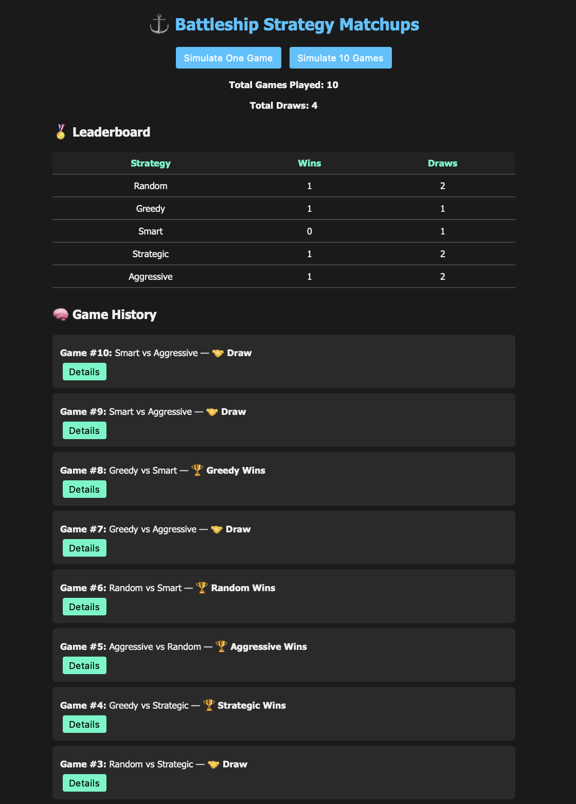
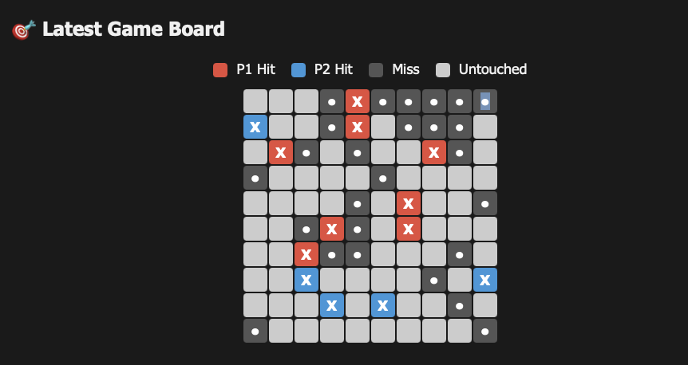

# Summary of the Game

Battleship is a 2-player strategy game where each player places a fleet of ships on a grid and takes turns guessing the coordinates of the opponent’s ships. The goal is to sink all enemy ships by correctly identifying their positions. Ships vary in size and occupy consecutive squares (horizontal or vertical). Key objects include the **Board** (ship placement + hit/miss tracking), **Ship** (size + remaining health), and **Player/Strategy** (attack decision logic). Rules reference: https://www.hasbro.com/common/instruct/Battleship.PDF

---

# Experiment Report

## Player Strategies

### 1. Aggressive
Aggressive prioritizes fast, forceful pressure early in the game by focusing attacks (e.g., emphasizing a specific region such as the top-left quadrant). It assumes opponents place ships in predictable areas and attempts to secure early hits. This strategy is high-risk/high-reward: it can win quickly against clustered placements but performs worse when ships are distributed or when the opponent’s placement is less predictable. It behaves like an AI that values speed and momentum over accuracy.

### 2. Greedy
Greedy focuses on converting hits into sinks quickly. After landing a hit, it queues nearby adjacent cells and aggressively “chases” to finish that ship as fast as possible. It isn’t optimized for long-term board coverage, but it can eliminate ships efficiently once a target is found. This strategy is strongest when it gets an early hit and can keep pressure on a single ship until it sinks.

### 3. Random
Random fires at completely random coordinates with no memory or adaptation. Each move is independent of prior results. While this can be inefficient, it can also be surprisingly effective against pattern-based expectations due to its unpredictability. Over long runs, it provides unbiased coverage, but lacks the efficiency of memory-based or patterned scanning.

### 4. Smart
Smart improves on Random by keeping memory of previously attacked cells and avoiding repeats. It still selects targets randomly, but eliminates wasted shots, increases overall coverage, and generally improves consistency. This strategy balances unpredictability with efficiency and tends to perform well against strategies that repeat or tunnel poorly.

### 5. Strategic
Strategic uses a patterned scanning approach (checkerboard-style targeting) based on the fact that ships occupy multiple consecutive cells. By firing at every second cell, it increases the probability of finding ships without needing to cover the entire board. After hits, it continues scanning rather than chasing as aggressively as Greedy. This strategy is methodical, efficient in longer matches, and reduces wasted shots.

---

## Procedure

We implemented a Battleship simulation framework to test five AI strategies: **Aggressive, Greedy, Smart, Strategic, and Random**.

Two runners were used:

1) **SimulationExperiment.java**  
Runs batch simulations (e.g., 50 games) and outputs summary counts such as total wins per strategy and draws.

2) **DetailedSimulationRunner.java**  
Runs fewer games per batch (e.g., 10 games) but records richer game-level and move-level details including player shots, hits/misses, and ship outcomes. This was the primary runner for deeper analysis because it provides more diagnostic detail.

### Trials and setup
- We ran a large batch of simulations totaling **~500 runs**, distributing matchups to keep comparisons fair and reduce randomness bias.
- For randomized experiments, each strategy participated in **100 games** worth of randomized matchups.
- Each simulation instantiates two AI players with chosen strategies and runs a full game from ship placement to end state.

### Data collected
Results were exported automatically into four CSV files:

- **game_results.csv** — per-game winner/draw and matchup
- **strategy_wins.csv** — aggregated wins/draws per strategy
- **game_stats.csv** — per-game stats (turns, hits, remaining ships, etc.)
- **detailed_game_log.csv** — every move of every game (coordinate + hit/miss)

### Comparison focus
We emphasized three key comparison lenses:
- **Aggressive vs Smart** (brute pressure vs efficiency/memory)
- **Greedy vs Strategic** (localized chase vs probability-based scanning)
- **Randomized 5-strategy mix** (unbiased overall performance)

---

## Results

### Table 1: Smart vs Aggressive (50-game summary)

| Strategy    | Wins | Losses | Draws |
|-------------|------|--------|-------|
| Smart       | 10   | 32     | 8     |
| Aggressive  | 32   | 10     | 8     |

#### Figure 1.0: Smart vs Aggressive Win % Bar Graph

---

### Table 2: Smart vs Aggressive (50-game detailed metrics)

| Strategy    | Wins | Win %  | Avg Hits | Avg Ships Left |
|-------------|------|--------|----------|----------------|
| Smart       | 10   | 20.0%  | 15.14    | 0.06           |
| Aggressive  | 32   | 64.0%  | 15.82    | 0.46           |
| Draw        | 8    | 16.0%  | —        | —              |

#### Figure 2.0: Smart vs Aggressive Scatter Plot

---

### Table 3: Greedy vs Strategic (50-game summary)

| Strategy    | Wins | Losses | Draws |
|-------------|------|--------|-------|
| Greedy      | 19   | 28     | 3     |
| Strategic   | 28   | 19     | 3     |

#### Figure 3.0: Greedy vs Strategic Win % Bar Graph

---

### Table 4: Greedy vs Strategic (50-game detailed metrics)

| Strategy    | Wins | Win %  | Avg Hits | Avg Ships Left |
|-------------|------|--------|----------|----------------|
| Greedy      | 17   | 34.0%  | 14.70    | 0.50           |
| Strategic   | 28   | 56.0%  | 15.85    | 0.80           |
| Draw        | 5    | 10.0%  | —        | —              |

#### Figure 4.0: Greedy vs Strategic Scatter Plot

---

### Table 5: Randomized matchups (500 total games; 100 per strategy)

| Strategy    | Wins | Draws | Losses | Avg Hits | Avg Ships Left |
|-------------|------|-------|--------|----------|----------------|
| Aggressive  | 45   | 10    | 45     | 15.64    | 0.43           |
| Smart       | 38   | 14    | 48     | 15.31    | 0.30           |
| Greedy      | 30   | 10    | 60     | 15.02    | 0.24           |
| Strategic   | 46   | 8     | 46     | 15.77    | 0.44           |
| Random      | 37   | 13    | 50     | 15.22    | 0.29           |

#### Figure 5.0: Randomized matchups Win % Bar Graph

---

## Analysis

Before running simulations, we expected **Aggressive** and **Strategic** to perform best due to their direct pressure (Aggressive) and efficient probability scanning (Strategic). The results generally supported this.

### Smart vs Aggressive
Aggressive dominated the matchup (64% win rate vs Smart’s 20%). Interestingly, draws were non-trivial (16%), suggesting that Smart can sometimes survive long enough to stall outcomes even if it struggles to finish strong.

Despite the large win gap, average hits were close (15.82 vs 15.14). The bigger separation was survivability: Aggressive ended with more ships remaining on average (0.46 vs 0.06). This indicates that Aggressive’s advantage shows up most in finishing power and endgame durability rather than purely landing more hits.

### Greedy vs Strategic
Strategic outperformed Greedy (56% vs 34%). Greedy’s “hit-then-chase” approach can produce strong moments when it finds a ship early, but Strategic remained more consistent across games.

Strategic also had higher average hits (15.85 vs 14.70) and significantly higher survivability (0.80 vs 0.50 ships left). This suggests it wins not only more often, but more cleanly.

### Randomized 5-strategy environment
In a randomized environment, **Strategic** and **Aggressive** led in win counts and survivability, with Strategic slightly ahead on overall consistency (hits + ships left). Aggressive showed the expected volatility: it wins often but also loses often.

Smart performed reasonably but continued to show weaker survivability. Random landed in the middle due to unpredictability but lacked efficiency. Greedy was the weakest overall in wins and ships left, suggesting it needs stronger board-coverage logic to compete.

Overall, **Strategic** emerged as the most reliable strategy because it balances efficient detection with reduced waste, giving it a long-run advantage.

---

# Notes on AI Assistance

During development, we used generative AI tools in two main ways:

1) Concept support and debugging help (understanding design approaches, breaking down tasks)
2) Help transforming CSV outputs into visuals and interpreting results

AI was most helpful when clarifying approaches and accelerating repetitive work (boilerplate, scaffolding, quick explanations). It was less reliable when interpreting data: we encountered occasional mistakes in column reading, counts, or assumptions, so results always needed verification.

We found IDE-integrated tools (e.g., code completion assistants) especially useful for repetitive patterns (getters/setters, test scaffolds) because they had direct access to the codebase and reduced the overhead of copying code back and forth.

---

# Web Demo (optional)

A lightweight web demo was built to visualize battles and results interactively. It supports single-game simulation, 10-game batches, a real-time visual board, and summary stats (hits, ships remaining, win/draw outcome). A simple leaderboard updates based on simulation outcomes.

Images:

